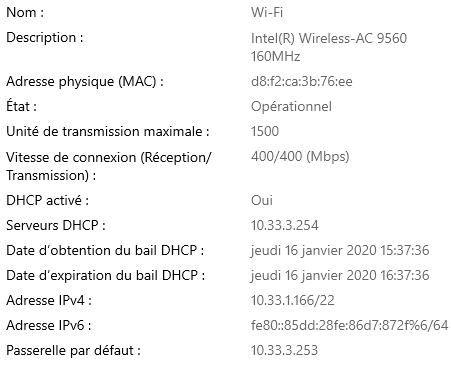
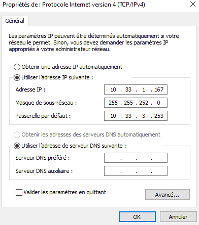

# I. Exploration locale en solo
## 1. Affichage d'informations sur la pile TCP/IP locale

Commande utilisée pour trouver les infos suivante : ipconfig /all

**Wifi**
Nom : Carte réseau sans fil Wi-Fi
Adresse MAC : Adresse physique . . . . . . . . . . . : D8-F2-CA-3B-76-EE
Adresse IP : Adresse IPv4. . . . . . . . . . . . . .: 10.33.1.166(préféré)

**Ethernet**
Nom : Carte Ethernet Ethernet
Adresse MAC : Adresse physique . . . . . . . . . . . : 00-D8-61-08-6E-F0
Adresse IP : Pas d'adresse ip parce que je ne suis pas connecté par cable ethernet 

**Gateway**
Adresse ip de la passerelle : Passerelle par défaut. . . . . . . . . : 10.33.3.253

**En graphique (GUI : Graphical User Interface)**

A quoi sert le gateway d'Ynov : Le gateway permet de relier le réseau Ynov au réseau Internet.

## 2. Modifications des informations
### A. Modification d'adresse IP (part 1)

Changement de l'adresse ip via l'intarface

Le réseau ne fonctionne plus parce que nous utilisons une adresse IP déjà utilisée donc il y a conflit.

### B. nmap