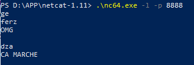
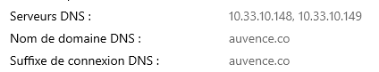

# I. Exploration locale en solo

## 1. Affichage d'informations sur la pile TCP/IP locale

Commande utilisée pour trouver les infos suivante : ipconfig /all

**Wifi**
Nom : Carte réseau sans fil Wi-Fi
Adresse MAC : Adresse physique . . . . . . . . . . . : D8-F2-CA-3B-76-EE
Adresse IP : Adresse IPv4. . . . . . . . . . . . . .: 10.33.1.166(préféré)

**Ethernet**
Nom : Carte Ethernet Ethernet
Adresse MAC : Adresse physique . . . . . . . . . . . : 00-D8-61-08-6E-F0
Adresse IP : Pas d'adresse ip parce que je ne suis pas connecté par cable ethernet 

**Gateway**
Adresse ip de la passerelle : Passerelle par défaut. . . . . . . . . : 10.33.3.253

**En graphique (GUI : Graphical User Interface)**

A quoi sert le gateway d'Ynov : Le gateway permet de relier le réseau Ynov au réseau Internet.

## 2. Modifications des informations

### A. Modification d'adresse IP (part 1)

Changement de l'adresse ip via l'intarface

Le réseau ne fonctionne plus parce que nous utilisons une adresse IP déjà  utilisée donc il y a conflit.

### B. nmap

### C. Modification d'adresse IP (part 2)

# II. Exploration locale en duo

**Parametre carte ethernet :**

**Test de la connexion :**

## 4. Utilisation d'un des deux comme gateway

**sur le PC qui n'a plus internet**

**sur le PC qui a toujours internet**

## 5. Petit chat privé

## 6. Wireshark

## 7. Firewall

# III. Manipulations d'autres outils/protocoles côté client

## 1. DHCP

DHCP : Serveur DHCP . . . . . . . . . . . . . : 10.33.3.254

Bail début : Bail obtenu. . . . . . . . . . . . . . : mercredi 29 janvier 2020 08:39:28
Bail fin :  Bail expirant. . . . . . . . . . . . . : mercredi 29 janvier 2020 10:44:00

Renouveler adresse ip :

## 2. DNS

**nslookup**

**reverselookup**

